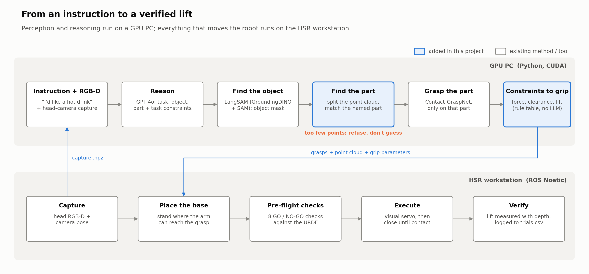
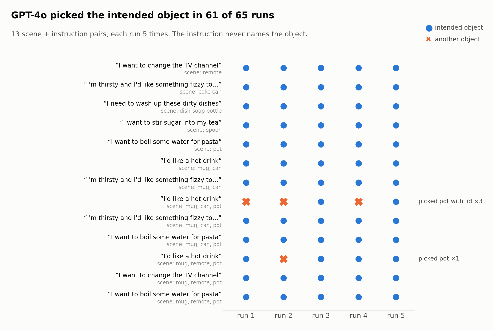
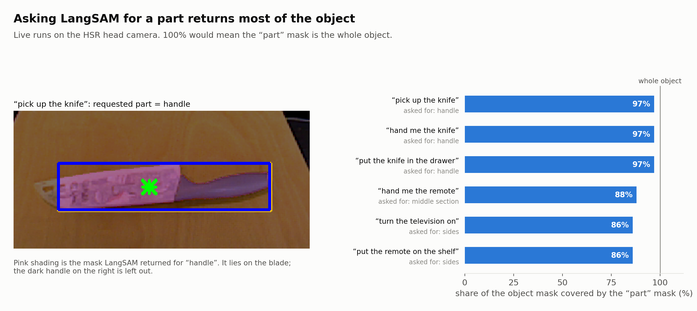
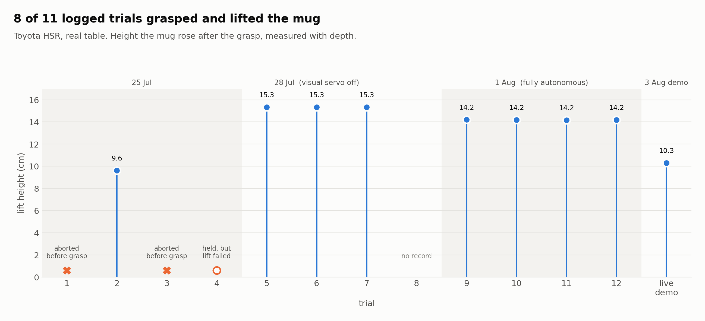

# intent-grasp-hsr

A Toyota HSR that works out what to pick up, and where to hold it, from an instruction that never names the object.

Say "I'd like a hot drink" and the robot has to work out that it wants the red mug, that it should hold it by the handle because the mug may be hot, and that the rim has to stay clear so you can drink from it. That's the actual output from the run logged on 7 Aug 2026. This repository is the code, data and figures from my MSc Robotics dissertation at Heriot-Watt University (supervised by Dr. Mauro Dragone). It runs on a real robot, not only in simulation.

The starting point was the AffordGrasp paper by Tang et al. (IROS 2025, [arXiv:2503.00778](https://arxiv.org/abs/2503.00778)). I reimplemented its reasoning idea, then spent most of the project on the parts that broke when I moved it onto real hardware. This is an independent project and isn't affiliated with the paper's authors.



## How it works

The pipeline has four stages.

1. Reasoning. GPT-4o reads the instruction and a head-camera image in three steps: what the task needs, which object in the scene satisfies it, and which part to grasp. Step 3 also returns task constraints, such as surfaces to keep clear, how firm the grip should be and what happens after the grasp. The output is structured JSON, and a contract check re-asks the model once if it contradicts itself (for example by picking the handle and also listing the handle as "keep clear").
2. Grounding. LangSAM (GroundingDINO + SAM) finds the whole object in the image. It turned out to be poor at finding *parts* (more on that below), so the part itself is found geometrically. `part_adaptive.py` splits the object's point cloud into structural components like a main body, a rim and side protrusions, then matches the part the model asked for against them. Components with too few points to trust are refused rather than guessed.
3. Grasping. Contact-GraspNet proposes grasps, restricted to the chosen part. The constraints from step 1 become closing force, cage clearance, close depth and lift height through a fixed rule table. No second model call happens here.
4. Execution. The HSR's 5-DoF arm can't reach most grasps from wherever the base happens to be standing, so a collision-aware planner picks a base pose first. On the recorded run none of the 25 candidates was reachable from the starting pose; after placement all 25 were. Execution then goes through gates: base settled, palm pose checked against forward kinematics, a visual-servo correction, a contact-stop close, and a lift that is checked with depth before the trial counts as a success.

Perception and the GPT-4o calls run on a Windows PC with a CUDA GPU. Anything that talks to the robot runs on the HSR workstation under ROS Noetic. The two sides swap `.npz` files over `scp`.

## What I found

Everything below was measured on real captures or the real robot. The charts are rebuilt from the recorded files by [`figures/readme/make_readme_figures.py`](figures/readme/make_readme_figures.py), so no number in them is typed in by hand.

### Picking the object works

Across 13 scene and instruction pairs, each repeated five times, GPT-4o chose the intended object 61 of 65 times (94%). All four misses happened the same way. With a mug and a pot on the table, step 1 turned "I'd like a hot drink" into something too general ("a container" three times, "a drink preparation appliance" once), and from there the pot looked like a fine answer.



### Finding the part with text prompts doesn't

Asking LangSAM for a part ("handle", "sides", "middle section") gave back a mask covering 86–97% of the object mask. All three knife instructions asked for the handle and all three came back at 97%. In the logged knife image the "handle" mask sits on the blade. That's why the part is found geometrically instead.



### The prompt decides what gets handed over

In the first version of the step-3 prompt, "hand me the X" picked the handle for 4 of the 6 objects. For a knife that means offering the blade to the person. Adding one paragraph asking the model to think about the person receiving the object changed the grasped part for 4 of the 6 objects:

| object | first prompt grasps | receiver-aware prompt grasps | keeps clear for the person |
|---|---|---|---|
| knife | handle | blade spine | handle |
| mug | handle | body | handle |
| hammer | handle | head | handle |
| bottle | neck | body | neck |
| bowl | rim | rim | interior |
| pan | handle | handle | handle |

The pan still contradicts itself: it grasps the handle and also says to keep the handle clear. I left it in because it shows the contract check doesn't catch everything.

### On the robot

Of 11 logged trials, 8 grasped and lifted the mug. The four trials on 1 Aug ran fully autonomously and all succeeded, with lift heights within 0.4 mm of each other. In trial 9 the visual servo brought the gripper from 46.9 px to 12.7 px off target before closing.



## Limitations

- `temperature=0` doesn't make GPT-4o deterministic. Two identical runs disagreed during development, which is why `vlm_stability.py` exists and why the numbers above come from five repeats instead of one pass.
- The geometric decomposition only sees what the depth camera resolves. Thin parts like a mug handle seen edge-on can fall under the evidence floor (60 points or 6 mm), and then the system refuses instead of guessing.
- The hardware trials used one object (the red mug) on one table. The clutter scenes were tested for perception and reasoning, not for full grasp execution.
- Trial 8 has no record in `trials.csv`. I left the gap rather than renumbering.
- Handle-side grasps on a mug are often out of reach for the HSR's wrist, which pushed the relocation trials toward body grasps.

## Repository layout

```
intent_grasp/          core library: reasoning, grounding, part decomposition, grasp generation, config
scripts/
  pipeline/            PC side: capture conversion, grounding + grasping, export, closure parameters
  robot/               workstation side (ROS Noetic): capture, base placement, preflight, execution
  experiments/         studies behind the results (VLM grid, identification stability, batch scenes...)
  tools/               one-off diagnostics and visualisers
figures/
  readme/              builds the four README charts from workspace/ data
  dissertation/        scripts for the dissertation figures (output in figures/out/)
  presentation/        scripts for the defence slides (output in workspace/generated_assets/)
tests/                 figure, data and part-decomposition tests
workspace/             real HSR captures, logged trials and recorded results; scripts read from here
third_party/           submodules: Contact-GraspNet, HSR description and meshes, YCB objects
docs/                  README images and the final presentation (presentation.pdf)
```

`workspace/` holds what the experiments actually produced: RGB-D captures from the HSR head camera, `trials.csv`, the VLM result tables and the experiment log from 7 Aug 2026. The figure scripts rebuild every chart from those files.

## Setup

Tested on Windows 11 with Python 3.11 and a CUDA 12.4 GPU.

```bash
git clone --recurse-submodules https://github.com/Irbaaz-Patel-13/intent-grasp-hsr.git
cd intent-grasp-hsr

python -m venv .venv
.venv\Scripts\activate            # Linux/macOS: source .venv/bin/activate

pip install torch==2.4.1 torchvision==0.19.1 --index-url https://download.pytorch.org/whl/cu124
pip install -r requirements.txt
pip install -e .
```

The GPT-4o steps need an OpenAI key in your environment (see `.env.example`):

```bash
set OPENAI_API_KEY=sk-...          # Linux/macOS: export OPENAI_API_KEY=sk-...
```

LangSAM downloads its own weights the first time it runs. The Contact-GraspNet checkpoint comes with the submodule.

## Running it

Run scripts from inside `workspace/`, since that's where they read and write their files.

On a recorded capture (no robot needed):

```bash
cd workspace
python ../scripts/pipeline/adapt_real_capture.py                 # head_capture_real.npz -> point cloud
python ../scripts/pipeline/run_grounding_grasp.py "hand me the mug"
python ../scripts/pipeline/export_grasps_plain.py
python ../scripts/pipeline/grasp_close_params.py                 # constraints -> force, lift, clearance
```

To reproduce the experiments, run `vlm_identify.py`, `vlm_stability.py`, `vlm_grid.py` and the others from `scripts/experiments/` in the same way. Each one explains its inputs and outputs at the top of the file.

To rebuild the figures from the recorded data:

```bash
python ../figures/readme/make_readme_figures.py         # the charts in this README
python ../figures/presentation/fig01_acquisition.py   # likewise fig02..fig12, then fig13
python ../figures/dissertation/fig_5_1_mask_coverage.py
```

The `presentation/` and `dissertation/` scripts are kept so the results can be traced back to their sources. Several of their layouts were never polished, so I'd treat the README charts and `docs/presentation.pdf` as the versions to look at.

To run the tests, from the repository root:

```bash
python -m pytest
```

The presentation pipeline summary (fig13) is built from the earlier presentation figures, so render fig01 to fig12 before running its test.

For the real robot, copy `scripts/robot/` to the HSR workstation and follow [scripts/robot/RUNBOOK.md](scripts/robot/RUNBOOK.md). It's the checklist I used for the recorded trials, gate by gate.

## Credits

- Tang et al., *AffordGrasp: In-Context Affordance Reasoning for Open-Vocabulary Task-Oriented Grasping in Clutter*, IROS 2025, for the three-step reasoning idea this builds on.
- [Contact-GraspNet](https://github.com/NVlabs/contact_graspnet) (NVIDIA) through the [PyTorch port](https://github.com/elchun/contact_graspnet_pytorch). It has its own non-commercial licence.
- [LangSAM](https://github.com/luca-medeiros/lang-segment-anything), [Toyota HSR meshes](https://github.com/ToyotaResearchInstitute/hsr_meshes) and the YCB object set.

My own code is MIT licensed (see [LICENSE](LICENSE)). The third-party submodules keep their own licences.
